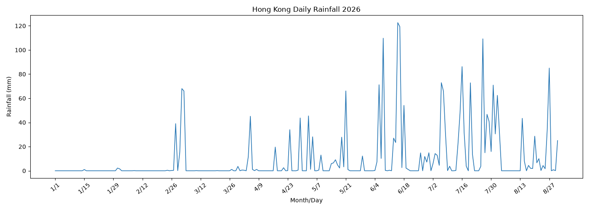

# Hong‑Kong‑Rainfall Visualisation

## The phenomenon
This visualisation explores the variation of daily rainfall in Hong‑Kong across the whole year. Hong‑Kong has a subtropical climate with a distinct rainy season. Heavy rainfall is mostly concentrated in summer months brought by monsoon and thunderstorms. The chart tracks daily precipitation values, showing large rainfall spikes during the wet season while rainfall keeps relatively low in cooler drier winter months. Observing these fluctuations helps us understand the seasonal rainfall pattern of this coastal city.
## The source
Dataset retrieved from the open data service of Hong Kong Observatory:
<https://www.hko.gov.hk/csci/>
## Project Structure
├── fetch.py        # download raw csv data from remote url
├── plot.py         # data cleaning and generate rainfall chart
├── data/           # generated runtime folder for downloaded csv (git ignored)
├── out/            # output image folder (git ignored)
├── README.md       # project introduction
└── PROCESS.md      # development log and bug‑fix record

## How to run
```bash
uv run fetch.py
uv run plot.py

## Data‑cleaning steps
1. Skip first two comment lines in source csv file
2. Strip status character such as "C" attached to rainfall value
3. Replace missing marker "***" with value 0.0
4. Adjust x‑axis tick labels to avoid text overlapping

## Output

Generated image path: `out/rainfall_plot.png`

